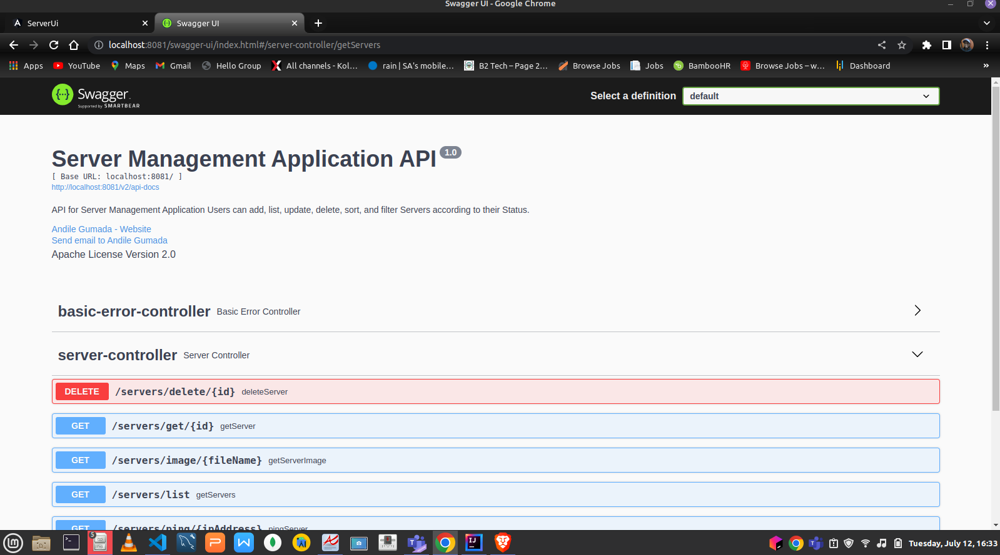
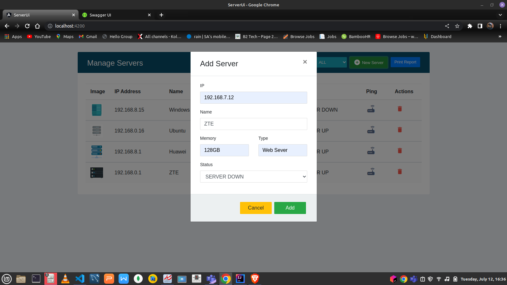
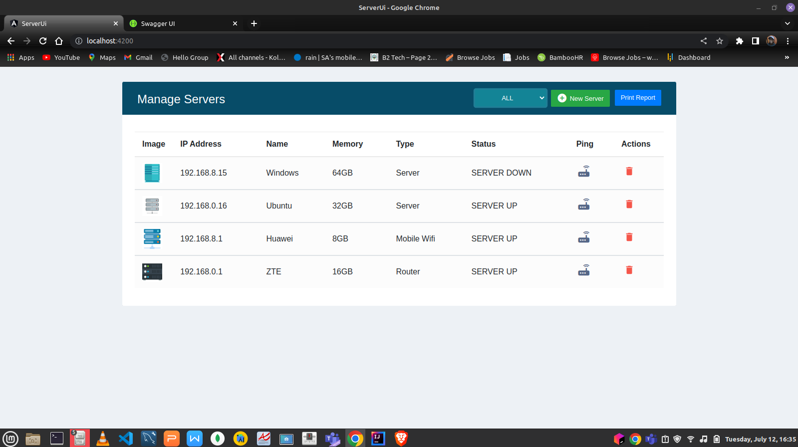

# Angular 9, Spring boot and MySQL Web Application - Server Application

A simple Server Management application built with Angular 9 and Spring boot that connects to the MySQL database. Application built using spring data JPA to perform database operations. Users can add, list, update, delete, sort, and filter the Servers according to their Status.

## Requirements

1. Java - 1.8.x

2. Maven - 3.x.x

3. Mysql - 5.x.x

4. Angular(TypeScript) - 9.x.x

5. NodeJs - 12.x.x

6. Npm - 6.x.x


## Steps to Set Up


**1. Clone the application**
```

git clone https://github.com/AndileGumada1/server-app.git
```

**2. Create Mysql database**
```
create database server
```

**3. Change mysql username and password as per your installation**

+ open `src/main/resources/application.properties`

+ change `spring.datasource.username` and `spring.datasource.password` as per your mysql installation

**4. Build and run the app using maven (server)**

```bash
mvn package
java -jar target/server-web-app-v1.jar
```

Alternatively, you can run the app without packaging it using -

```bash
mvn spring-boot:run
```

```
Access Swagger-UI
http://localhost:8081/swagger-ui/index.html#/server-controller/getServers
 
```


The app will start running at <http://localhost:8081>.

## Explore Rest APIs

The app defines following CRUD APIs.
    
    POST /servers/save
        
    GET /servers/image/{fileName}

    GET /servers/list
  
    GET /servers/ping/{ipAddress}

    PUT /servers/update/{id}
  
    GET /servers/get/{id}

    DELETE /servers/delete{id}

You can test them using postman or any other rest client.

**5. Install node modules for angular application (server-ui)**

```bash
npm install
```

**6. Run the angular application**

```bash
ng serve
```

Alternatively, you can run the below command to open the application in default web browser -

```bash
ng serve --open
```
Add

List
